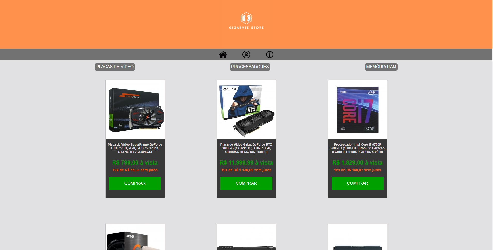
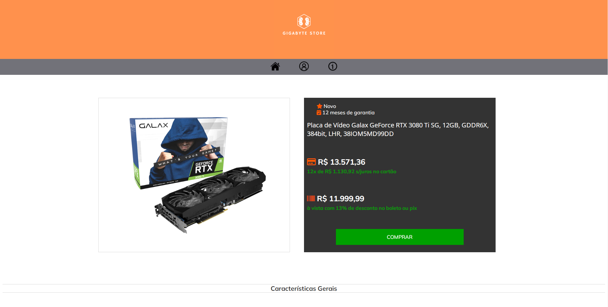
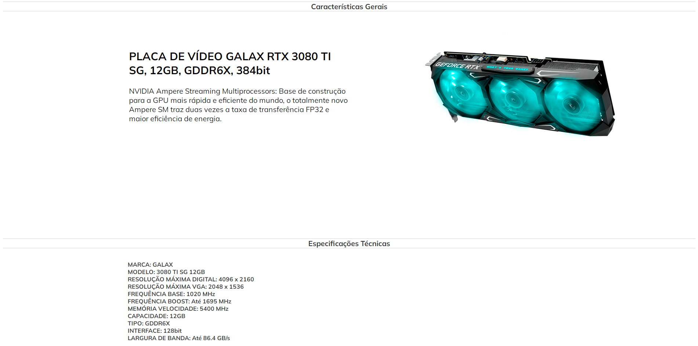
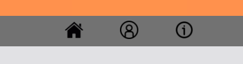
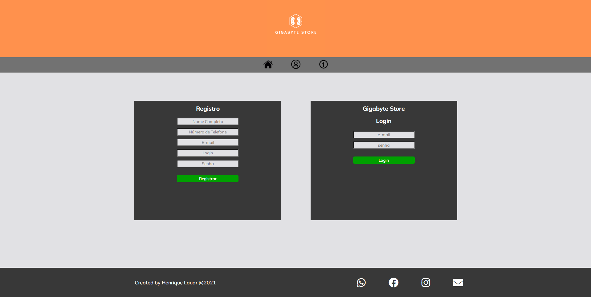
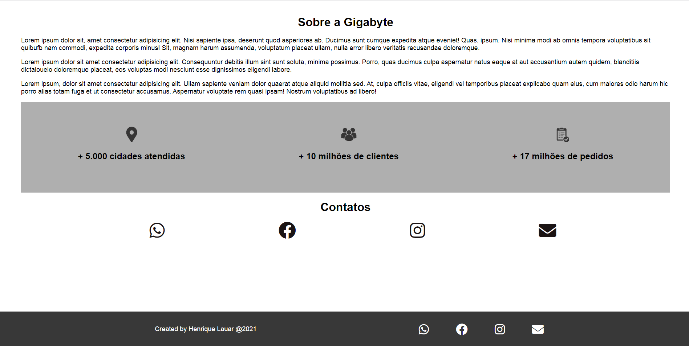
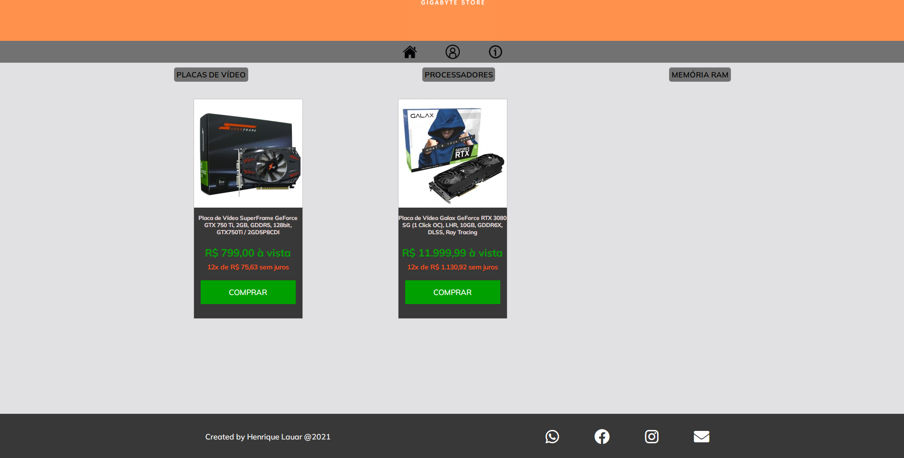
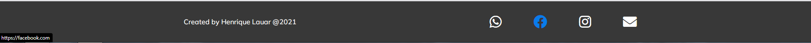
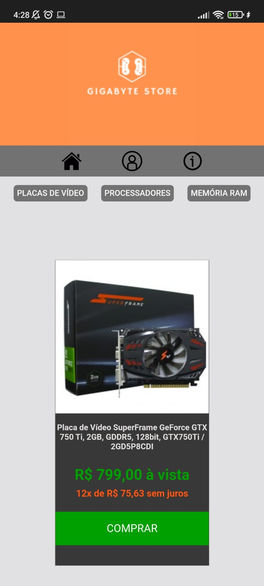

<<<<<<< HEAD
<h1 align= center>Projeto Gigabyte Store</h1>

<h4 align= center>Projeto com o intuito de aprender os fundamentos e as funcionalidades de HTML e CSS</h4>

Sobre
-------------------

#### Esse projeto foi realizado como o 1º desafio de HTML e CSS do curso para formação em Desenvolvimento Full Stack da Gama Academy. Como proposta, criei uma loja de peças de hardware com HTML e CSS puros, colocando todos os conhecimentos adquiridos em 2 semanas de curso.

Linguagens
-------------------
- HTML5
- CSS3

-------------------
### **Dispositivos**
- O site opera em todos os dispositivos com telas de dimensões entre 1920px e 375px
-------------------
### **Status do projeto**:
O projeto está finalizado e conta com as seguintes funcionalidades:
 - Página inicial com 6 variedades de produtos

-------------------
 - Página exclusiva para cada um dos produtos com preço, opções de compra, detalhes do produto e especificações técnicas

-------------------
 - Menu com botões de página inicial, página de login e registro e página institucional

-------------------
 - Página exclusiva para se fazer registro e o login no site

-------------------
 - Página institucional com informações sobre a empresa

-------------------
 - Páginas de filtro por departamento de produto

-------------------
 - Rodapé com copyright e ícones linkados às redes sociais e que acendem a cor da logo ao passar com o mouse por cima

-------------------
 Responsividade para todos os dispositivos

### **Site desenvolvido por:**
- Henrique Sousa Lauar
-------------------

Site hospedado no seguinte link
https://henriquelauar.github.io/Gigabyte-Store/
